# prelimactivitynumber2-donotincludeanycode-angelanebres
prelimactivitynumber2-donotincludeanycode-angelanebres created by GitHub Classroom

MAIN MENU

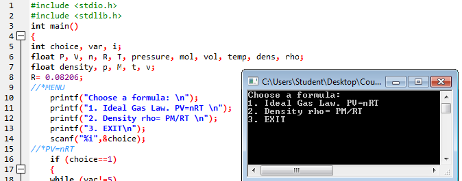

FIRST FORMULA - can solve for each of the unknown variables given 3 variables. goes back to the variable selection screen.can select 
another variable to compute. but cannot go back to the main menu yet

SECOND FORMULA - can solve for each of the unknown variables given 3 variables. goes back to the variable selection screen.can select 
another variable to compute. but cannot go back to the main menu yet

JUNE 07, 2016
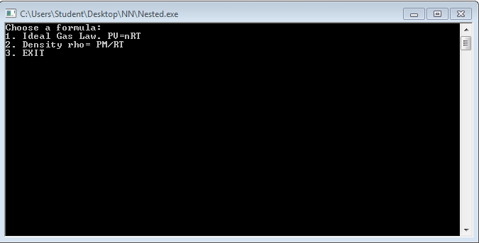
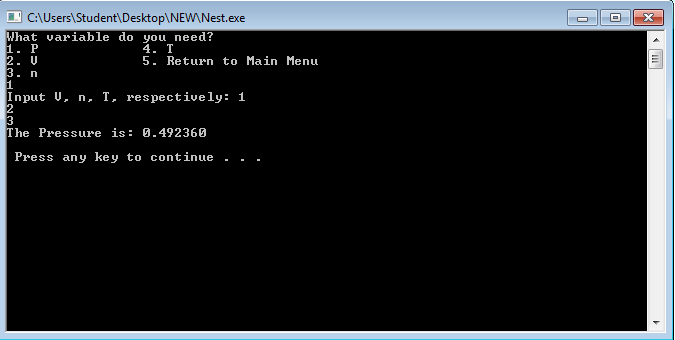
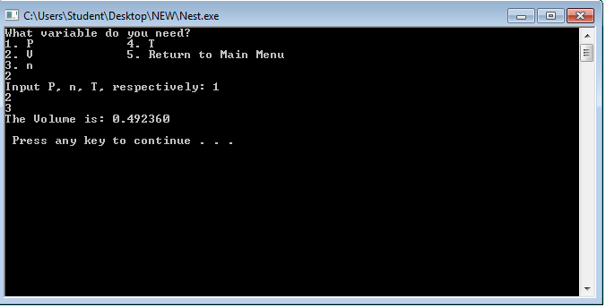
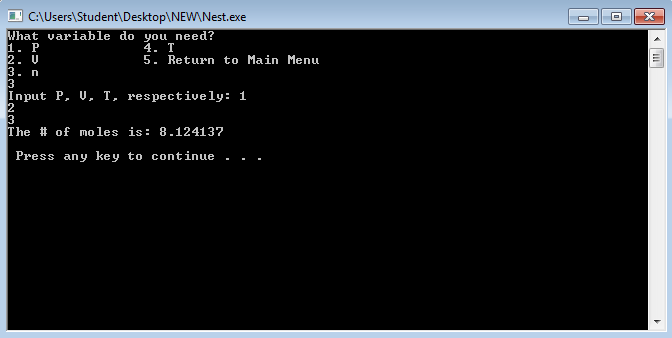
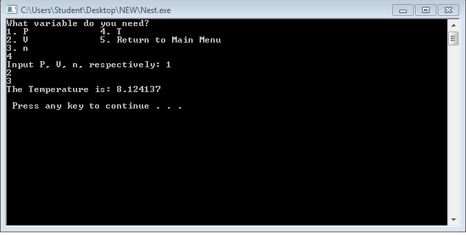
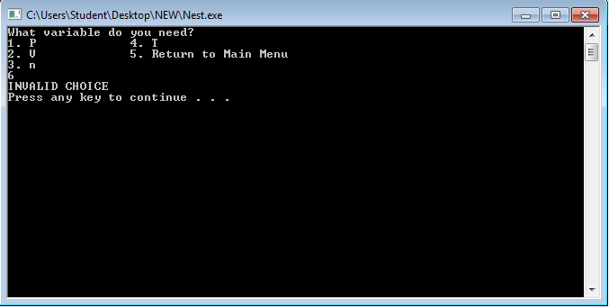
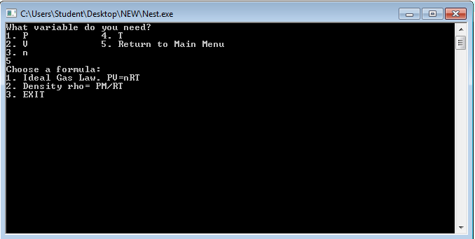

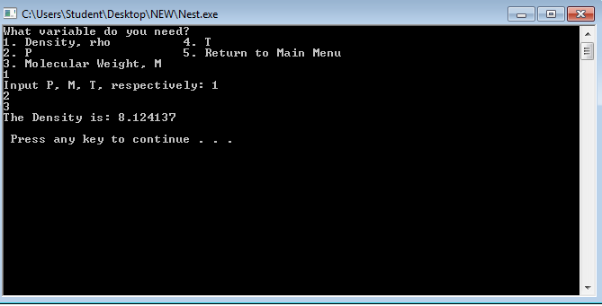
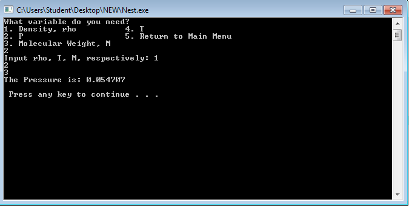
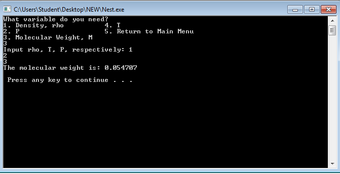
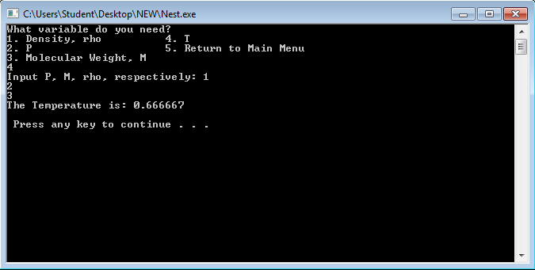
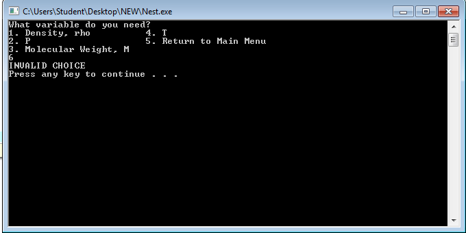
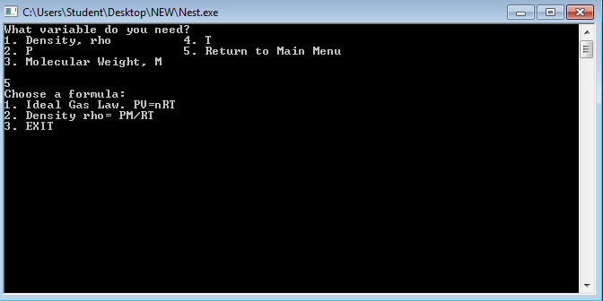
