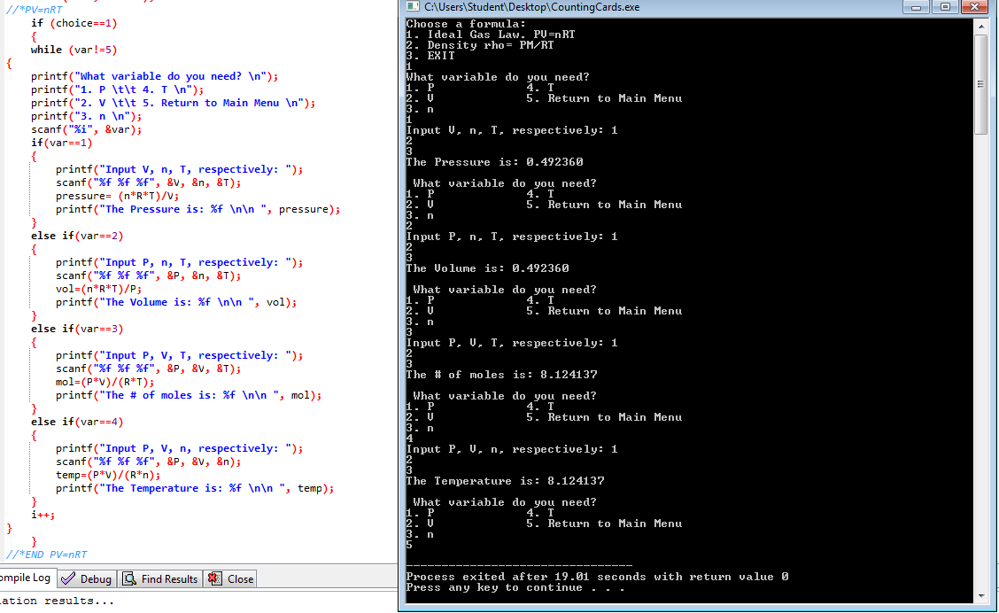
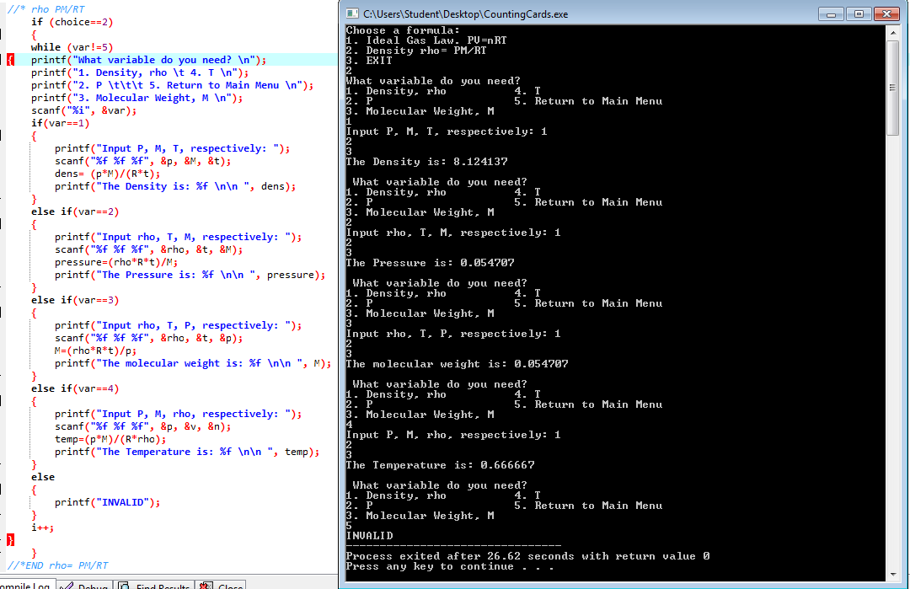
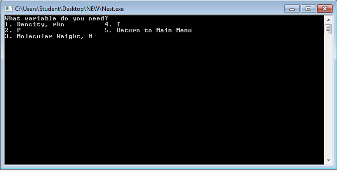
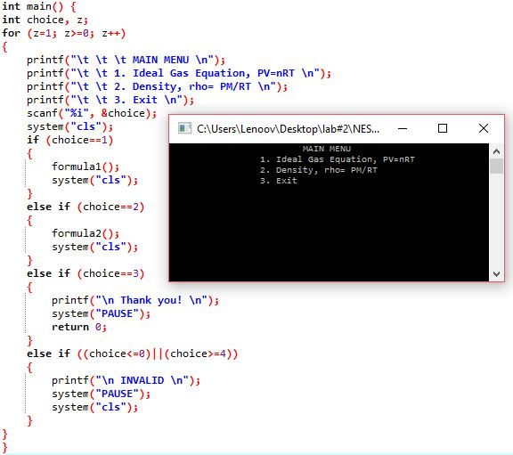

# prelimactivitynumber2-donotincludeanycode-angelanebres
prelimactivitynumber2-donotincludeanycode-angelanebres created by GitHub Classroom

MAIN MENU

FIRST FORMULA - can solve for each of the unknown variables given 3 variables. goes back to the variable selection screen.can select 
another variable to compute. but cannot go back to the main menu yet

SECOND FORMULA - can solve for each of the unknown variables given 3 variables. goes back to the variable selection screen.can select 
another variable to compute. but cannot go back to the main menu yet

JUNE 07, 2016
  It works, however, the screen doesn't clear up when "return to main menu"
  

*UPDATE - names of variables spelled out. previous problems resolved

